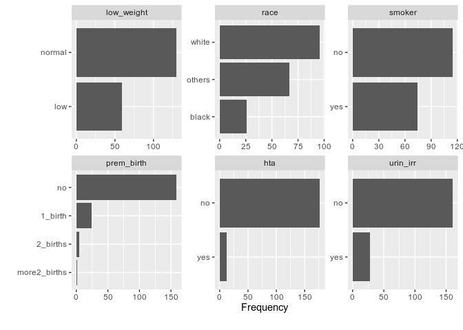
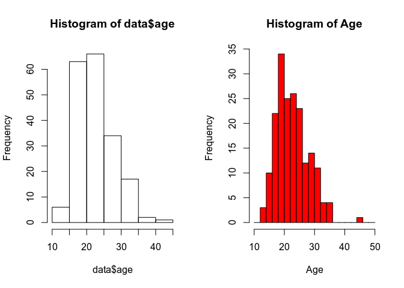
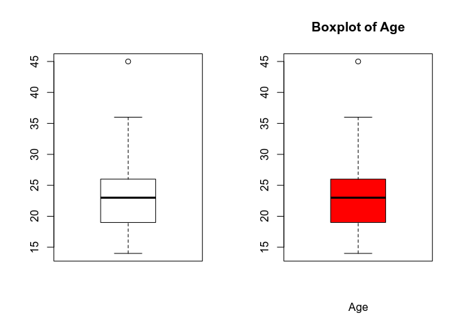
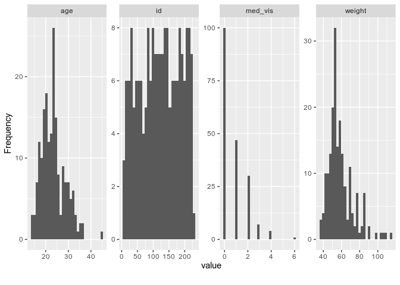
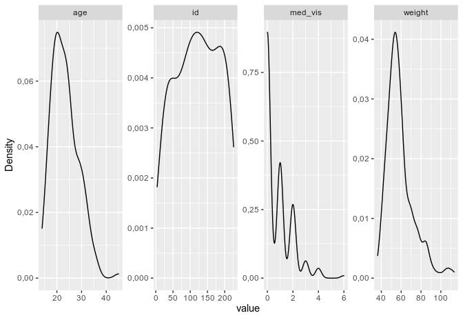
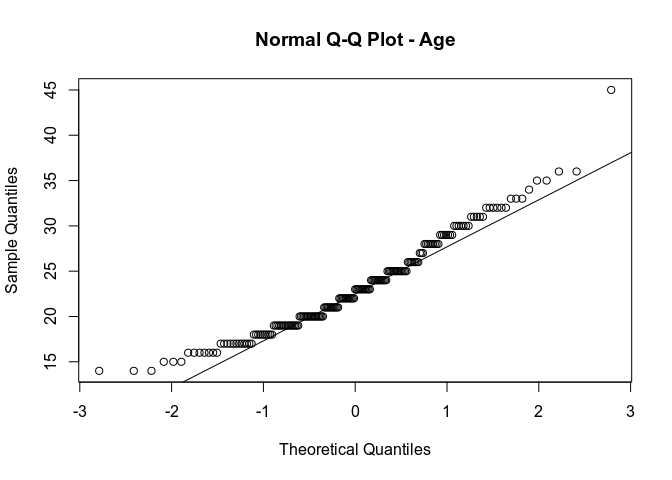
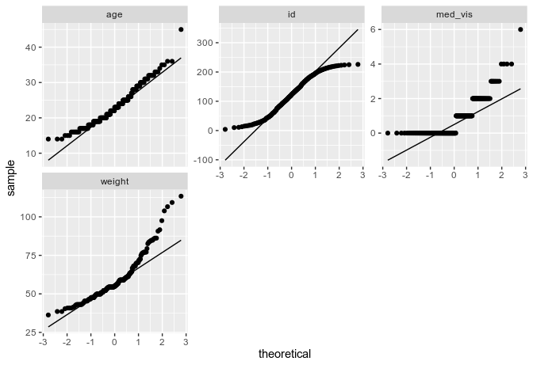

## Summary

1. Summary()
2. Categorical Variable
    * Absolute freq / Relative Frequencies (%)
    * Pie or Barplot graphs
3. Continuous Variable -> Normality Test
    * ND -> Mean and SD
    * NND -> Median, interquantile Range
    * Histogram or Boxplot

 
## Description of a Discrete Variable

-   Number of predetermined finite categories. Alphabetic or numeric
    codes
-   Describe a quality of the sample
-   Ordinal variables: the categories have a natural order

### Summary Measures

As an example and guide, we analize the response variable; Bajo peso al
nacer:

    low_weight <- data$low_weight

    # Absolute frequencies: Number of observations presented by each of the categories
    t1 <- table(low_weight)
    t1

    ## low_weight
    ## normal    low 
    ##    130     59

    # # Relative frequencies: Quotient between absolute frequencies and sample size, expressed in proportions or percentages
    p1 <- prop.table(t1)
    p1_round <- round(p1*100, dig=2)
    p1_round

    ## low_weight
    ## normal    low 
    ##  68.78  31.22

Using the DataExplorer package, we can easily plot the frequency
distribution of all discrete variables:

    plot_bar(data)

### Graphics

As in the previous example, we analize the response variable; *low
weight at birth*, as a guide. Also, have in mind that to execute graphs
in a terminal, we always need to write the function dev.new() first

    # Sectors diagrams: Graphic representation in the form of a circle with areas proportional to theabsolute or relative frequency of each category
    dev.new()
    par(mfrow=c(1,2))
    pie(t1)
    pie(t1, col=c("red","blue"), main="Low weight at birth", 
            labels=paste(names(t1), " (", p1_round ,"%)", sep=""))

    # Bar chart: Graphical representation where the abscissa axis represents the categories and relative or absolute frequencies on the ordinate axis
    dev.new()
    par(mfrow=c(1,2))
    barplot(t1)
    barplot(t1, col=c("red","blue"), main="Low weight at birth", 
            names.arg=paste(names(t1), " (", round( p1 * 100, dig=2),"%)", sep=""))

## Description of a Continuous Variable

-   Variables measured on a numerical scale
-   Defined range: minimum and maximum

### Summary measures of central tendency

As an example and guide, we analize the variable *age*^. \* *Mean:* This
measures describes the arithmetic of the sample:

    mean(data$age)

    ## [1] 23,2381

-   *Median:* Central value in an ordered data set, half data on the
    right and half on the left.

<!-- -->

    median(data$age)

    ## [1] 23

The median is a robust estimator because it is not as sensitive as the
mean to distant values.

### Position or location measurements

The quantile or percentile of order p of a distribution (0 &lt;p &lt;1):
Pp value such that a proportion p of data values &lt;= Pp.

-   Quartiles: percentiles 0.25, 0.50, 0.75
-   Tertiles: 0.3333, 0.6666 percentiles
-   Deciles: percentiles 0.10, 0.20,…., 0.90

<!-- -->

    quantile(data$age, c(0.10,0.25,0.50,0.75,0.90))

    ## 10% 25% 50% 75% 90% 
    ##  17  19  23  26  31

The median and the quartiles Q1 and Q3 divide the observations into 4
parts that they contain 25% of the data each. The mean is not enough to
describe a sample, a measure of dispersion is necessary.

### Measures of dispersion

Measures that quantify how scattered the data is around of a measure of
central tendency. Its important to mention that the following functions
contain an important parameter to treat missing values; na.rm=TRUE.

-   *Variance:* It is the mean of the squared deviations from the mean

<!-- -->

    var(data$age)

    ## [1] 28,07599

-   *Typical deviation:* It is the square root of the variance, and is a
    measure of variability in the same units as the sample data.

<!-- -->

    sd(data$age)

    ## [1] 5,298678

-   *Coefficient of variation:* Express variability in a unitless
    measure.

<!-- -->

    100 * abs(sd(data$age) / mean(data$age))

    ## [1] 22,80169

-   *Rangs*: is the difference between the maximum and minimum value.

<!-- -->

    range(data$age)

    ## [1] 14 45

-   *Interquartile range*: is the difference between the first and third
    quartiles, and is a measure of dispersion in 50% of the core data.

<!-- -->

    IQR(data$age)

    ## [1] 7

-   *MAD (median absolute dev*iation): is the median of the deviations
    in value absolute of the observations with respect to the median.

<!-- -->

    mad(data$age)

    ## [1] 5,9304

-   The interquartile range and MAD are robust estimators because they
    are not as sensitive as the standard deviation to far values, since
    they are based on in the median and in the position measures.

### Graphics

-   *Histogram:* Bar chart where the frequencies of the grouped variable
    are represented in intervals

<!-- -->

    par(mfrow=c(1,2))
    hist(data$age)
    hist(data$age, col="red", main="Histogram of Age", 
                  xlab="Age", ylab="Frequency",
                  xlim=c(10,50), breaks=seq(10,50, by=2))

\* *Boxplot:* Graphic based on the distribution of the quartils
(including median), with an easy identification of the outliers values.

    par(mfrow=c(1,2))
    boxplot(data$age)
    boxplot(data$age, col="red", main="Boxplot of Age", xlab="Age")

Using the DataExplorer package, we can easily and quickly create
histograms and density plots to analyze all continuous variables present
in the study.

    # View histogram of all continuous variables
    plot_histogram(data)

    # View estimated density distribution of all continuous variables
    plot_density(data)

## Summary Function

The summary () function has as an argument a data frame, and displays:
\* Absolute frequencies for categorical variables \* Basic statistics
for continuous variables \* Number of missings of each variable, if any

    summary(data)

    ##        id         low_weight       age            weight           race   
    ##  Min.   :  4,0   normal:130   Min.   :14,00   Min.   : 36,29   white :96  
    ##  1st Qu.: 68,0   low   : 59   1st Qu.:19,00   1st Qu.: 49,90   black :26  
    ##  Median :123,0                Median :23,00   Median : 54,89   others:67  
    ##  Mean   :121,1                Mean   :23,24   Mean   : 58,88              
    ##  3rd Qu.:176,0                3rd Qu.:26,00   3rd Qu.: 63,50              
    ##  Max.   :226,0                Max.   :45,00   Max.   :113,40              
    ##  smoker           prem_birth   hta      urin_irr     med_vis      
    ##  no :115   no          :159   no :177   no :161   Min.   :0,0000  
    ##  yes: 74   1_birth     : 24   yes: 12   yes: 28   1st Qu.:0,0000  
    ##            2_births    :  5                       Median :0,0000  
    ##            more2_births:  1                       Mean   :0,7937  
    ##                                                   3rd Qu.:1,0000  
    ##                                                   Max.   :6,0000

Normality
---------

Some statistical tests require that the variables be distributed
according to a normal distribution, and this must be checked

## Checking normality. Hypothesis test

-   H0: the data are distributed according to a normal distribution
-   Shapiro-Wilks test: Small samples (&lt;30, &lt;50)

<!-- -->

    # Our sample is larger than 50, so this wouldn't be the best choice, but we'll still see the command.
    shapiro.test(data$age)

    ## 
    ##  Shapiro-Wilk normality test
    ## 
    ## data:  data$age
    ## W = 0,95977, p-value = 3,189e-05

-   Kolmogorov-Smirnov test with correction: Large samples (&gt; 30,&gt;
    50). It is a more general test, and it can be used for any
    distribution besides the normal - needs to load nortest library

<!-- -->

    lillie.test(data$age)

    ## 
    ##  Lilliefors (Kolmogorov-Smirnov) normality test
    ## 
    ## data:  data$age
    ## D = 0,094517, p-value = 0,000303

-   In both cases we reject the hypothesis of normality for p-values
    &lt; 0.05

## Checking normality. Graphical methods

-   Q-Q Plot: the quantiles observed in the data are shown against the
    theoretical ones; If the points fit a line, the data follow the
    theoretical distribution

<!-- -->

    qqnorm(data$age, main="Normal Q-Q Plot - Age")
    qqline(data$age)

Using the DataExplorer package, we can easily and quickly create qq
plots to analyse the normality of all continuous variables present in
the study.

    # View quantile-quantile plot of all continuous variables
    plot_qq(data)

## Transformations of a variable

-   A continuous variable can be transformed to make it follow a normal
    distribution, or at least have a symmetric distribution. The family
    of Transformations Power Xp is usually used with p ≠ 0. It is useful
    to try a simpler and more interpretable set of these transformations
-   If we want to correct the skew to the right, we increase the power
    (x²); sqrt(max(x+1)-x),log10(max(x+1)-x)
-   If we want to correct the skew to the left, we dicrease the power;
    sqrt(x), log10(x)

Interesting resource for data transformations:
<a href="https://www.datanovia.com/en/lessons/transform-data-to-normal-distribution-in-r/" class="uri">https://www.datanovia.com/en/lessons/transform-data-to-normal-distribution-in-r/</a>

    ## R version 3.6.1 (2019-07-05)
    ## Platform: x86_64-conda_cos6-linux-gnu (64-bit)
    ## Running under: Ubuntu 20.04.1 LTS
    ## 
    ## Matrix products: default
    ## BLAS/LAPACK: /home/marbatlle/miniconda3/envs/r/lib/R/lib/libRblas.so
    ## 
    ## locale:
    ## [1] es_ES.UTF-8
    ## 
    ## attached base packages:
    ## [1] stats     graphics  grDevices utils     datasets  methods   base     
    ## 
    ## other attached packages:
    ##  [1] nortest_1.0-4      DataExplorer_0.8.1 forcats_0.5.0      stringr_1.4.0     
    ##  [5] dplyr_1.0.2        purrr_0.3.4        readr_1.4.0        tidyr_1.1.2       
    ##  [9] tibble_3.0.4       ggplot2_3.3.2      tidyverse_1.3.0    tinytex_0.26      
    ## [13] knitr_1.30        
    ## 
    ## loaded via a namespace (and not attached):
    ##  [1] Rcpp_1.0.5        lubridate_1.7.9   assertthat_0.2.1  digest_0.6.26    
    ##  [5] utf8_1.1.4        R6_2.4.1          cellranger_1.1.0  backports_1.1.10 
    ##  [9] reprex_0.3.0      evaluate_0.14     httr_1.4.2        pillar_1.4.6     
    ## [13] rlang_0.4.8       readxl_1.3.1      rstudioapi_0.11   data.table_1.13.2
    ## [17] blob_1.2.1        rmarkdown_2.4     labeling_0.4.2    htmlwidgets_1.5.2
    ## [21] igraph_1.2.6      munsell_0.5.0     broom_0.7.2       compiler_3.6.1   
    ## [25] modelr_0.1.8      xfun_0.18         pkgconfig_2.0.3   htmltools_0.5.0  
    ## [29] tidyselect_1.1.0  gridExtra_2.3     fansi_0.4.1       crayon_1.3.4     
    ## [33] dbplyr_1.4.4      withr_2.3.0       grid_3.6.1        jsonlite_1.7.1   
    ## [37] gtable_0.3.0      lifecycle_0.2.0   DBI_1.1.0         magrittr_1.5     
    ## [41] scales_1.1.1      cli_2.1.0         stringi_1.5.3     farver_2.0.3     
    ## [45] fs_1.5.0          xml2_1.3.2        ellipsis_0.3.1    generics_0.0.2   
    ## [49] vctrs_0.3.4       tools_3.6.1       glue_1.4.2        hms_0.5.3        
    ## [53] networkD3_0.4     parallel_3.6.1    yaml_2.2.1        colorspace_1.4-1 
    ## [57] rvest_0.3.6       haven_2.3.1
