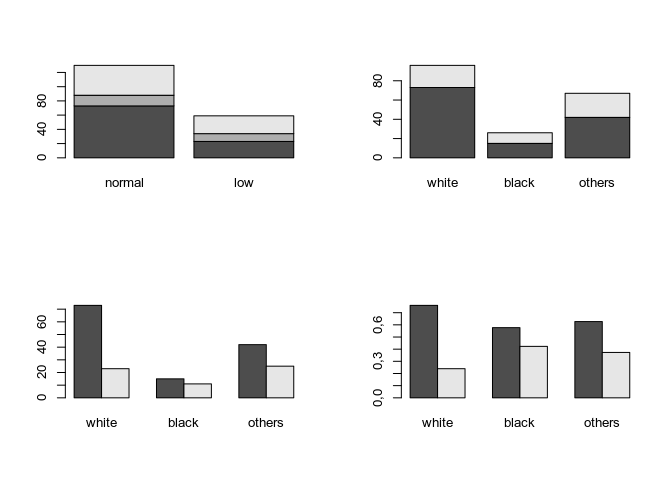
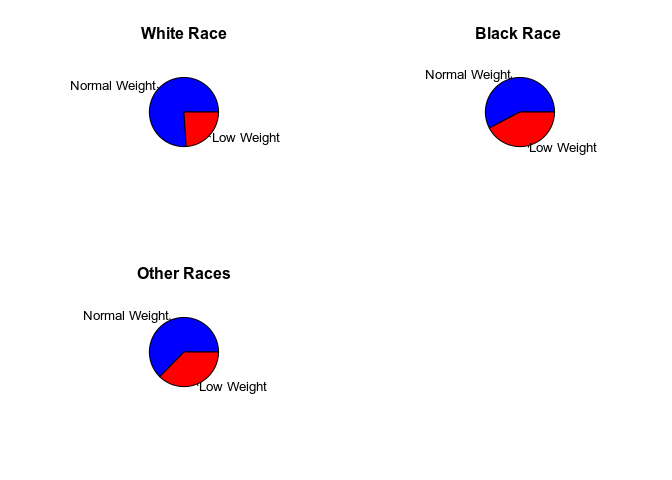

Summary 
=======

1.  Contingency Table
2.  Graphs: Barplots and Pie
3.  Independence Test: Chi-Squared or Fisher
4.  Relative Risk and Odds Ratio

Contingency Tables
==================

Contingency tables are used to explore the relationship between two
categorical variables. Normally, you want to explore the distribution of
a categorical variable in the different groups, defined by the other
variable. Description of the contingency table:

-   Absolute frequencies

<!-- -->

    t1 <- table(data$race, data$low_weight)
    t1

    ##         
    ##          normal low
    ##   white      73  23
    ##   black      15  11
    ##   others     42  25

-   Marginal frequencies by rows and / or columns

<!-- -->

    margin.table (t1, 1) ## Marginal frequencies by rows

    ## 
    ##  white  black others 
    ##     96     26     67

    margin.table (t1, 2) ## Marginal frequencies by columns

    ## 
    ## normal    low 
    ##    130     59

-   Proportions by rows and / or columns

<!-- -->

    prop.table(t1) ## Total Proportions

    ##         
    ##              normal        low
    ##   white  0.38624339 0.12169312
    ##   black  0.07936508 0.05820106
    ##   others 0.22222222 0.13227513

    prop.table(t1, 1) ## Proportions by rows

    ##         
    ##             normal       low
    ##   white  0.7604167 0.2395833
    ##   black  0.5769231 0.4230769
    ##   others 0.6268657 0.3731343

    prop.table(t1, 2) ## Proportions by columns

    ##         
    ##             normal       low
    ##   white  0.5615385 0.3898305
    ##   black  0.1153846 0.1864407
    ##   others 0.3230769 0.4237288

-   Percentages by rows and / or columns

<!-- -->

    round( 100*prop.table(t1, 1), dig=2 ) ## Percentages by rows

    ##         
    ##          normal   low
    ##   white   76.04 23.96
    ##   black   57.69 42.31
    ##   others  62.69 37.31

Graph for a contingency table
-----------------------------

### Bar charts

    par(mfrow=c(2,2))
    barplot( t1 )
    barplot( t(t1) )
    barplot( t(t1), beside=T )
    barplot( prop.table ( t(t1),2 ), beside=T )



### Pie charts

    par(mfrow=c(2,2))
    lab.low=c("Normal Weight", "Low Weight")
    col.1 = c("blue", "red")
    pie( t1[1,], col=col.1, main="White Race", lab=lab.low )
    pie( t1[2,], col=col.1, main="Black Race ", lab=lab.low )
    pie( t1[3,], col=col.1, main="Other Races", lab=lab.low )

Independence Test
-----------------

### Chi-square test

Test of independence between the two categorical variables. \* H0: X, Y
are independent \* H1: X, Y are not independent

You want to test whether the distribution of one of the categorical
variables is similar in all categories of the other variable.

    chisq.test(t1)

    ## 
    ##  Pearson's Chi-squared test
    ## 
    ## data:  t1
    ## X-squared = 5,0048, df = 2, p-value = 0,08189

    chisq.test(t1)$p.value

    ## [1] 0,0818877

    chisq.test(t1)$expected

    ##         
    ##            normal       low
    ##   white  66,03175 29,968254
    ##   black  17,88360  8,116402
    ##   others 46,08466 20,915344

#### Limitations of the chi-square test

-   The chi-square test is an asymptotic test, for large samples.
-   It is valid when the expected frequencies are not very small: up to
    20-25% of cells with expected values are usually supported less
    than 5.
-   If this condition is not fulfilled, categories of one of the
    categorical variables.

As an alternative to the chi-square test, the exact test of Fisher,
which is always valid, and therefore is the one usually used to small
samples, or when there are cells with low expected values. Chi-square
test is usually more conservative than Fisher’s exact test.

### Fisher Test

    fisher.test(t1)

    ## 
    ##  Fisher's Exact Test for Count Data
    ## 
    ## data:  t1
    ## p-value = 0,07889
    ## alternative hypothesis: two.sided

    fisher.test(t1)$p.value

    ## [1] 0,07888813

Relative risk
-------------

This measure is used to assess the association between exposure to a
risk factor and an event (a disease), both being binary variables. \*
The Relative Risk is the quotient between the risk of the occurrence
disease when factor is present and when factor is absent. \* The
relative risk expresses how much more likely it is to develop the
disease in factor presence versus factor absence.

    t1 <- table ( data$smoker, data$low_weight)
    t1

    ##      
    ##       normal low
    ##   no      86  29
    ##   yes     44  30

    a <- t1[2,2] ## E=1 F=1
    b <- t1[2,1] ## E=0 F=1
    c <- t1[1,2] ## E=1 F=0
    d <- t1[1,1] ## E=0 F=0
    # Relative Risk (RR)
    RR <- (a/(a+b)) / (c/(c+d))
    RR

    ## [1] 1,607642

Odds Ratio
----------

• An Odd (advantage) is a proportion divided by its complement. \* Odd =
p / (1 - p) expresses how much more likely it is that an event will
occur versus not occurring. It is an alternative way of expressing a
probability. • The Odds Ratio is defined as the ratio of the odd of
having the disease in presence of the factor with respect to the odd of
having it in the absence of the factor.

    ## Odds Ratio (OR)
    OR <- (a*d) / (b*c)
    OR

    ## [1] 2,021944

    ## R version 3.6.1 (2019-07-05)
    ## Platform: x86_64-conda_cos6-linux-gnu (64-bit)
    ## Running under: Ubuntu 20.04.1 LTS
    ## 
    ## Matrix products: default
    ## BLAS/LAPACK: /home/marbatlle/miniconda3/envs/r/lib/R/lib/libRblas.so
    ## 
    ## locale:
    ## [1] es_ES.UTF-8
    ## 
    ## attached base packages:
    ## [1] stats     graphics  grDevices utils     datasets  methods   base     
    ## 
    ## other attached packages:
    ##  [1] nortest_1.0-4      DataExplorer_0.8.1 forcats_0.5.0      stringr_1.4.0     
    ##  [5] dplyr_1.0.2        purrr_0.3.4        readr_1.4.0        tidyr_1.1.2       
    ##  [9] tibble_3.0.4       ggplot2_3.3.2      tidyverse_1.3.0    tinytex_0.26      
    ## [13] knitr_1.30        
    ## 
    ## loaded via a namespace (and not attached):
    ##  [1] tidyselect_1.1.0  xfun_0.18         haven_2.3.1       colorspace_1.4-1 
    ##  [5] vctrs_0.3.4       generics_0.0.2    htmltools_0.5.0   yaml_2.2.1       
    ##  [9] utf8_1.1.4        blob_1.2.1        rlang_0.4.8       pillar_1.4.6     
    ## [13] glue_1.4.2        withr_2.3.0       DBI_1.1.0         dbplyr_1.4.4     
    ## [17] modelr_0.1.8      readxl_1.3.1      networkD3_0.4     lifecycle_0.2.0  
    ## [21] munsell_0.5.0     gtable_0.3.0      cellranger_1.1.0  rvest_0.3.6      
    ## [25] htmlwidgets_1.5.2 evaluate_0.14     parallel_3.6.1    fansi_0.4.1      
    ## [29] broom_0.7.2       Rcpp_1.0.5        scales_1.1.1      backports_1.1.10 
    ## [33] jsonlite_1.7.1    fs_1.5.0          gridExtra_2.3     hms_0.5.3        
    ## [37] digest_0.6.26     stringi_1.5.3     grid_3.6.1        cli_2.1.0        
    ## [41] tools_3.6.1       magrittr_1.5      crayon_1.3.4      pkgconfig_2.0.3  
    ## [45] ellipsis_0.3.1    data.table_1.13.2 xml2_1.3.2        reprex_0.3.0     
    ## [49] lubridate_1.7.9   assertthat_0.2.1  rmarkdown_2.4     httr_1.4.2       
    ## [53] rstudioapi_0.11   R6_2.4.1          igraph_1.2.6      compiler_3.6.1
