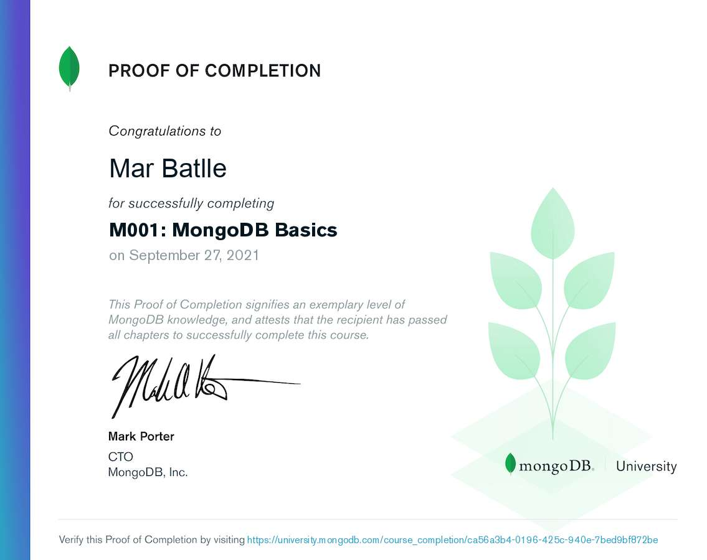

# MongoDB

*Basic pointers and commands to make use of one of the most popular NoSQL database programs*

Notes from the *MOO1-MongoDB Basics* course from MongoDB Unniversity:

**Course Description**: In this course you will learn how to set up your database and start exploring different ways to search, create, and analyze your data with MongoDB. We will cover database performance basics, and discover how to get started with creating applications and visualizing your data. Learn more about the course at https://university.mongodb.com/courses/M001/about

**Course Certificate**

