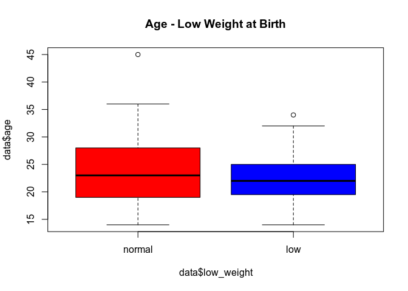
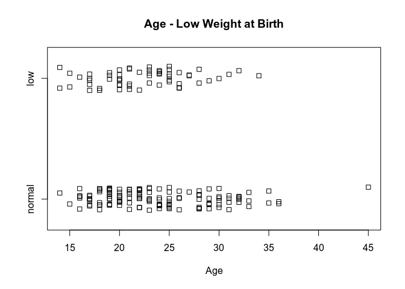
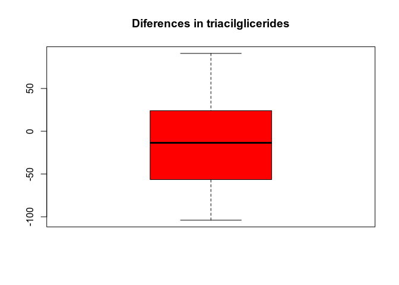

# Continuous and Categorical with 2 groups

Summary
=======

1.  Graphs: Boxplot and Stripchart
2.  Normality?
-   Yes -&gt; Variance Test + correspondant Student’s t-test
-   No -&gt; Mann-Whitney Test

Graphs
======

    ## Boxplot
    boxplot(data$age ~ data$low_weight, col=c("red","blue"), main="Age - Low Weight at Birth" )

    ## Stripchart (the "jitter" option is because it is not known how many observations there are at each point). Makes sense for small samples
    stripchart(data$age ~ data$low_weight, method="jitter" , xlab="Age", main="Age - Low Weight at Birth" )

Statistical Tests
=================

Data with Normal Distribution
-----------------------------

Before testing the values of the continue varible in two groups using
the Student’s t-test, we need to confirm a normal distribution in the
sample.

Since in this case, the sample is &gt; 30 we’ll use the
Kolmogorov-Smirnov test. It is a more general test, and it can be used
for any distribution besides the normal.

    lillie.test (data$age[data$low_weight=="normal"])

    ## 
    ##  Lilliefors (Kolmogorov-Smirnov) normality test
    ## 
    ## data:  data$age[data$low_weight == "normal"]
    ## D = 0,10928, p-value = 0,0006339

    lillie.test(data$age[data$low_weight=="low"])

    ## 
    ##  Lilliefors (Kolmogorov-Smirnov) normality test
    ## 
    ## data:  data$age[data$low_weight == "low"]
    ## D = 0,088393, p-value = 0,301

In this case, we accept the hypothesis of normality for only one of the
groups, low weight variable is low, since the p-value in the other group
is &lt; 0.05. Given this result, it would be more adequate to use the
no-parametric test of Mann-Whitney instead of the Student’s t-test.

To set up an example/guide, we’ll continue working as if we had
confirmed the normality in both groups.

### Statistical tests dor comparing variances

There are different solutions to test for equality (homogeneity) of
variance across groups, including:

-   *F-test:* Compare the variances of two samples. The data must be
    normally distributed.
-   *Bartlett’s test:* Compare the variances of k samples, where k can
    be more than two samples. The data must be normally distributed. The
    Levene test is an alternative to the Bartlett test that is less
    sensitive to departures from normality.
-   *Levene’s test:* Compare the variances of k samples, where k can be
    more than two samples. It’s an alternative to the Bartlett’s test
    that is less sensitive to departures from normality.
-   *Fligner-Killeen test:* a non-parametric test which is very robust
    against departures from normality.

For all these tests,

-   the null hypothesis is that all populations variances are equal;
-   the alternative hypothesis is that at least two of them differ.

<!-- -->

    ## F-test
    var.test (data$age ~ data$low_weight)

    ## 
    ##  F test to compare two variances
    ## 
    ## data:  data$age by data$low_weight
    ## F = 1,5323, num df = 129, denom df = 58, p-value = 0,06885
    ## alternative hypothesis: true ratio of variances is not equal to 1
    ## 95 percent confidence interval:
    ##  0,9669261 2,3389614
    ## sample estimates:
    ## ratio of variances 
    ##           1,532254

The p-value of F-test is 0.06885 which is greater than the significance
level 0.05. In conclusion, we’d say that there is no significant
difference between the two variances.

But since we can’t say our data distributes normally, we’d execute the
levene Test, in this case, as you can see the p-value is 0.1019, so we
can confirm that we accept that the variable age has the same variance
in both groups.

    library(car)
    leveneTest(data$age ~ data$low_weight)

    ## Levene's Test for Homogeneity of Variance (center = median)
    ##        Df F value Pr(>F)
    ## group   1  2,7021 0,1019
    ##       187

### Student’s t test

The Student’s t test tests whether the mean of a continuous variable is
equal in two independent samples.

-   H0: μ1 = μ2
-   H1: μ1 ≠ μ2

<!-- -->

    ## Test de igualdad de medias. T de Student
    t.test (data$age ~ data$low_weight)

    ## 
    ##  Welch Two Sample t-test
    ## 
    ## data:  data$age by data$low_weight
    ## t = 1,7737, df = 136,94, p-value = 0,07834
    ## alternative hypothesis: true difference in means is not equal to 0
    ## 95 percent confidence interval:
    ##  -0,1558349  2,8687423
    ## sample estimates:
    ## mean in group normal    mean in group low 
    ##             23,66154             22,30508

    t.test (data$age ~ data$low_weight, var.equal=T)

    ## 
    ##  Two Sample t-test
    ## 
    ## data:  data$age by data$low_weight
    ## t = 1,6381, df = 187, p-value = 0,1031
    ## alternative hypothesis: true difference in means is not equal to 0
    ## 95 percent confidence interval:
    ##  -0,2770981  2,9900056
    ## sample estimates:
    ## mean in group normal    mean in group low 
    ##             23,66154             22,30508

If the p-value is inferior or equal to the significance level 0.05, we
can reject the null hypothesis and accept the alternative hypothesis. In
other words, we can conclude that the mean values of group A and B are
significantly different. In this case since the p-value &gt; 0.05, we
can’t conclude that the mean values of both groups are significally
different.

### Student’s t test for 2 paired samples or related samples

Tests whether the mean of a continuous variable is equal in two samples
that they are not independent

-   H0: μ1 = μ2
-   H1: μ1 ≠ μ2

Applies when each observation of a sample is related to another of the
other sample. For example, a variable that has been measured in the same
individuals in two moments of time. If the data are not distributed
according to a normal distribution, a Nonparametric Mann-Whitney test
for paired samples, based on ranges, which tests whether the
distributions are equal.

    ## Triglyceride data from 16 patients, before and after a diet
    trigl.basal <- c(159,93,130,174,148,148,85,180,92,89,204,182,110,88,134,84)
    trigl.final <- c(194,122,158,154,93,90,101,99,183,82,100,104,72,108,110,81)
    trigl.dif <- trigl.final - trigl.basal
    trigl.dif

    ##  [1]   35   29   28  -20  -55  -58   16  -81   91   -7 -104  -78  -38   20  -24
    ## [16]   -3

    ## Boxplot
    boxplot ( trigl.dif, col=c("red","blue"), main="Diferences in triacilglicerides" )

    ## Normality contrasts of the differences
    lillie.test( trigl.dif )

    ## 
    ##  Lilliefors (Kolmogorov-Smirnov) normality test
    ## 
    ## data:  trigl.dif
    ## D = 0,10386, p-value = 0,9159

    ## Test of equality of means for paired samples. Student's t
    t.test ( trigl.basal, trigl.final, paired=T )

    ## 
    ##  Paired t-test
    ## 
    ## data:  trigl.basal and trigl.final
    ## t = 1,2019, df = 15, p-value = 0,248
    ## alternative hypothesis: true difference in means is not equal to 0
    ## 95 percent confidence interval:
    ##  -12,0368  43,1618
    ## sample estimates:
    ## mean of the differences 
    ##                 15,5625

    ## Nonparametric Mann-Whitney test or Wilcoxon test for paired samples
    wilcox.test ( trigl.basal, trigl.final, paired=T )

    ## Warning in wilcox.test.default(trigl.basal, trigl.final, paired = T): cannot
    ## compute exact p-value with ties

    ## 
    ##  Wilcoxon signed rank test with continuity correction
    ## 
    ## data:  trigl.basal and trigl.final
    ## V = 89,5, p-value = 0,2774
    ## alternative hypothesis: true location shift is not equal to 0

The difference between the 2 measurements is calculated. The normality
test must be carried out on this variable difference. In this case, the
null hypothesis of equality of the vvariable is accepted in the 2
moments (P = 0.248).

You can also do an analysis with multiple variables.

Data with No Normal Distribution
--------------------------------

Nonparametric tests are more general, testing whether the distributions
are equal.

### Mann-Whitney test

The Mann-Whitney test or Wilcoxon test contrasts whether distributions
of 2 independent samples are equal:

-   H0: equal distributions
-   H1: different distributions

It is said to be a non-parametric test, because it does not make
assumptions about the distribution of the continuous variable. It is a
rank-based test:

-   The 2 samples are ordered together, and ranges are assigned, the
    order in which they appear every observation
-   The contrast statistic is based on the sum of the ranks of one of
    the 2 samples, and is an approximation for large samples

<!-- -->

    ## Test on the Mann-Whitney parametric the Wilcoxon test
    wilcox.test ( data$age ~ data$low_weight)

    ## 
    ##  Wilcoxon rank sum test with continuity correction
    ## 
    ## data:  data$age by data$low_weight
    ## W = 4238, p-value = 0,2471
    ## alternative hypothesis: true location shift is not equal to 0

Both the Student’s t test (P = 0.103) and the Mann-Whitney test (P =
0.247) indicate that there is no significant difference in the mother’s
age in the 2 groups (those who had children with normal weight and the
who had it underweight).

Session Info
============

    ## R version 3.6.1 (2019-07-05)
    ## Platform: x86_64-conda_cos6-linux-gnu (64-bit)
    ## Running under: Ubuntu 20.04.1 LTS
    ## 
    ## Matrix products: default
    ## BLAS/LAPACK: /home/marbatlle/miniconda3/envs/r/lib/R/lib/libRblas.so
    ## 
    ## locale:
    ## [1] es_ES.UTF-8
    ## 
    ## attached base packages:
    ## [1] stats     graphics  grDevices utils     datasets  methods   base     
    ## 
    ## other attached packages:
    ##  [1] car_3.0-10         carData_3.0-4      nortest_1.0-4      DataExplorer_0.8.1
    ##  [5] forcats_0.5.0      stringr_1.4.0      dplyr_1.0.2        purrr_0.3.4       
    ##  [9] readr_1.4.0        tidyr_1.1.2        tibble_3.0.4       ggplot2_3.3.2     
    ## [13] tidyverse_1.3.0    tinytex_0.26       knitr_1.30        
    ## 
    ## loaded via a namespace (and not attached):
    ##  [1] Rcpp_1.0.5        lubridate_1.7.9   assertthat_0.2.1  digest_0.6.26    
    ##  [5] utf8_1.1.4        R6_2.4.1          cellranger_1.1.0  backports_1.1.10 
    ##  [9] reprex_0.3.0      evaluate_0.14     httr_1.4.2        pillar_1.4.6     
    ## [13] rlang_0.4.8       curl_4.3          readxl_1.3.1      rstudioapi_0.11  
    ## [17] data.table_1.13.2 blob_1.2.1        rmarkdown_2.4     foreign_0.8-71   
    ## [21] htmlwidgets_1.5.2 igraph_1.2.6      munsell_0.5.0     broom_0.7.2      
    ## [25] compiler_3.6.1    modelr_0.1.8      xfun_0.18         pkgconfig_2.0.3  
    ## [29] htmltools_0.5.0   tidyselect_1.1.0  gridExtra_2.3     rio_0.5.16       
    ## [33] fansi_0.4.1       crayon_1.3.4      dbplyr_1.4.4      withr_2.3.0      
    ## [37] grid_3.6.1        jsonlite_1.7.1    gtable_0.3.0      lifecycle_0.2.0  
    ## [41] DBI_1.1.0         magrittr_1.5      scales_1.1.1      zip_2.1.1        
    ## [45] cli_2.1.0         stringi_1.5.3     fs_1.5.0          xml2_1.3.2       
    ## [49] ellipsis_0.3.1    generics_0.0.2    vctrs_0.3.4       openxlsx_4.2.2   
    ## [53] tools_3.6.1       glue_1.4.2        hms_0.5.3         networkD3_0.4    
    ## [57] abind_1.4-5       parallel_3.6.1    yaml_2.2.1        colorspace_1.4-1 
    ## [61] rvest_0.3.6       haven_2.3.1
