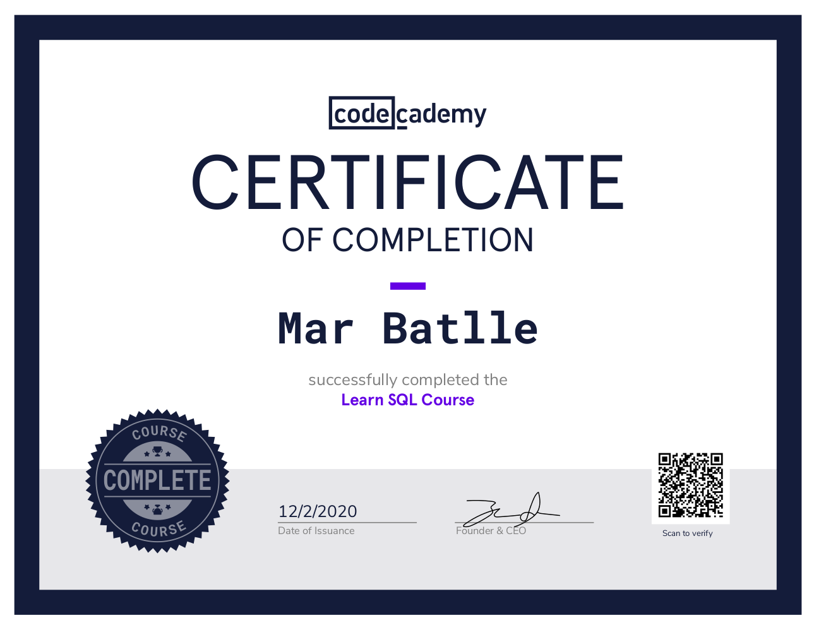

# SQL

*Summary of most basic tools and commands to communicate with relational databases through SQL; how to manipulate data and build queries that communicate with more than one table.*

**SQL** is a domain-specific language used in programming and designed for managing data held in a relational database management system, or for stream processing in a relational data stream management system.

Notes from the *Learn SQL* course from Codecademy:

**Course Description**: Learn to communicate with databases using SQL, the standard data management language. Including; Manipulation, queries, aggregate functions and multiple tables.

**Course Certificate**

The link: https://www.codecademy.com/profiles/netNinja82250/certificates/042a4e5884e3eb6ea1f2a12be6abb851

Also took notes from classes at ISCIII, MSc Personalized Medicine and Health Bioinformatics module, by professor JM Gonzalez.
